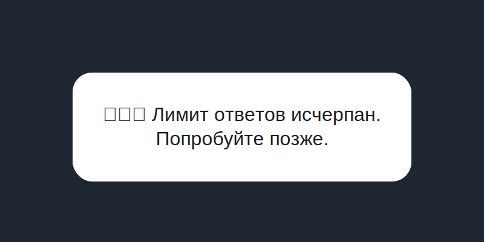

# Поведение rate limit и проверка ручками

## Цепочка `DialogEngine → rateLimit → notifier → fallback`
1. **`DialogEngine`** всегда начинает обработку с вызова `rateLimit.checkAndIncrement` с `userId` и контекстом (chat/thread). Если адаптер вернул `limit`, ядро немедленно возвращает `status: 'rate_limited'` и дальше по цепочке не идёт.【F:apps/worker-main/core/DialogEngine.ts†L41-L86】
2. **`createRouter`** после выполнения `DialogEngine` проверяет статус. Когда приходит `rate_limited`, он сначала пробует `rateLimitNotifier.notify`, а затем, если notifier отсутствует или ответил `handled: false`, выполняет резервную отправку `RATE_LIMIT_FALLBACK_TEXT` обычным `messaging.sendText`. Эта отправка происходит даже тогда, когда notifier деградировал и писал предупреждения в лог — пользователи получают сообщение напрямую от роутера.【F:apps/worker-main/http/router.ts†L660-L777】
3. **`rateLimitNotifier`** формирует отдельное текстовое уведомление c подсказкой о времени до снятия ограничения и логирует `rate limit notification sent`/`failed to send rate limit notification`. Он опционален, поэтому деградация не влияет на доставку fallback-текста, а в логах воркера остаётся запись `[router] rate limit notifier failed …` перед резервным отправлением.【F:apps/worker-main/features/limits/rate-limit-notifier.ts†L1-L103】【F:apps/worker-main/http/router.ts†L744-L777】
4. **`RATE_LIMIT_FALLBACK_TEXT`** жёстко задан в роутере как `🥶⌛️ Лимит ответов исчерпан. Попробуйте позже.` и отправляется тем же MessagingPort, что и любые другие ответы, поэтому телеграм-клиент пользователя ведёт себя предсказуемо даже под нагрузкой.【F:apps/worker-main/http/router.ts†L26-L34】【F:apps/worker-main/http/router.ts†L732-L777】

## Ограничения и особенности
- **50 сообщений / 24 часа по умолчанию.** Если окружение не переопределяет лимит, то используются значения `DEFAULT_RATE_LIMIT = 50` и `DEFAULT_RATE_LIMIT_WINDOW_MS = 24 * 60 * 60 * 1000` (сутки).【F:apps/worker-main/index.ts†L95-L96】
- **Нет отдельных исключений для администраторов.** После обработки системных команд любые обычные сообщения попадают в `DialogEngine`, который не различает роли и вызывает тот же `RateLimitPort` для всех пользователей, в том числе для whitelisted админов.【F:apps/worker-main/http/router.ts†L660-L777】
- **`RATE_LIMIT_KV` — единый источник истины, но его сбой не блокирует чат.** Адаптер `createKvRateLimitAdapter` читает/пишет счётчик в ключах вида `rate_limit[:scope:<scope>][:chat:<chatId>][:thread:<threadId>]:user:<userId>:bucket:<N>`. Ошибка чтения или записи логируется и приводит к «разрешить» (`return 'ok'`), поэтому деградация KV выключает лимит вместо того, чтобы ломать диалог.【F:apps/worker-main/adapters/kv-rate-limit/index.ts†L24-L213】
- **Тумблер `LIMITS_ENABLED`** (см. `createRateLimitToggle`) позволяет полностью обойти RateLimitPort, но на поведение fallback-текста это не влияет: он активируется только при `status: 'rate_limited'`.【F:apps/worker-main/features/limits/rate-limit-toggle.ts†L20-L132】【F:apps/worker-main/http/router.ts†L660-L777】

## Как воспроизвести лимит в тестовой среде
1. **Подготовьте контекст.** Узнайте `userId`/`chatId` тестового пользователя и namespace `RATE_LIMIT_KV`. Расчитайте текущий `bucket` для суточного окна: `node -e "const windowMs=24*60*60*1000;console.log(Math.floor(Date.now()/windowMs));"` (см. `computeWindowInfo`).【F:apps/worker-main/adapters/kv-rate-limit/index.ts†L73-L139】
2. **Подтяните текущее значение счётчика.** Выполните `wrangler kv:key get --namespace-id <RATE_LIMIT_KV> "rate_limit:user:<userId>:bucket:<bucket>" --text` и убедитесь, что значение меньше лимита 50. Если ключа нет — создайте его вручную значением 49, чтобы следующий диалог превысил порог.【F:apps/worker-main/adapters/kv-rate-limit/index.ts†L104-L213】【F:apps/worker-main/index.ts†L95-L96】
3. **Искусственно доведите счётчик до порога.** Командой `wrangler kv:key put --namespace-id <RATE_LIMIT_KV> "rate_limit:user:<userId>:bucket:<bucket>" --value 50 --expiration-ttl 86400` заставьте KV зафиксировать потолок окна (TTL равен остаткам до конца суток; см. `toTtlSeconds`).【F:apps/worker-main/adapters/kv-rate-limit/index.ts†L146-L213】
4. **Отправьте дополнительное сообщение в бот.** Следующее пользовательское сообщение пойдёт через `DialogEngine`, получит `status: 'rate_limited'`, а роутер вызовет notifier и fallback. В `wrangler tail` ищите запись `"message":"[router] rate limit notifier failed"` (если notifier выключен/не отвечает) или `[telegram] sendText status=200 … route:'rate_limit_fallback'`. Оба лога появляются внутри `logMessagingCall` в момент отправки текста `RATE_LIMIT_FALLBACK_TEXT`.【F:apps/worker-main/http/router.ts†L210-L333】【F:apps/worker-main/http/router.ts†L744-L777】
5. **Проверьте, что пользователь получил уведомление.** Ожидаемая картинка показана ниже; сообщение приходит даже при деградации notifier-а, потому что fallback вызывается без условий после неуспеха `notify`. Если нужно снять ограничение, удалите ключ из KV или дождитесь истечения окна.

## Примеры для саппорта
- **Фрагмент лога:**

  ```text
  [router] rate limit notifier failed Error: Telegram 429
    at notify (...)
  [telegram] sendText status=200 { action: 'sendText', route: 'rate_limit_fallback', chatIdNormalizedHash: '...', fromIdHash: '...' }
  ```
  > Первая строка приходит из `console.warn` в роутере, вторая — из `logMessagingCall`, подтверждающая доставку fallback-а.【F:apps/worker-main/http/router.ts†L210-L333】【F:apps/worker-main/http/router.ts†L744-L777】

- **Скрин уведомления:**

  
